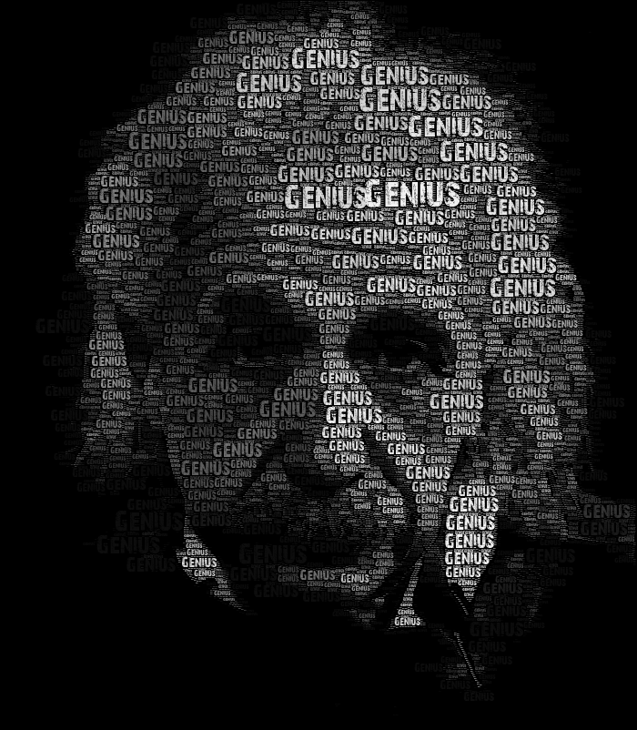
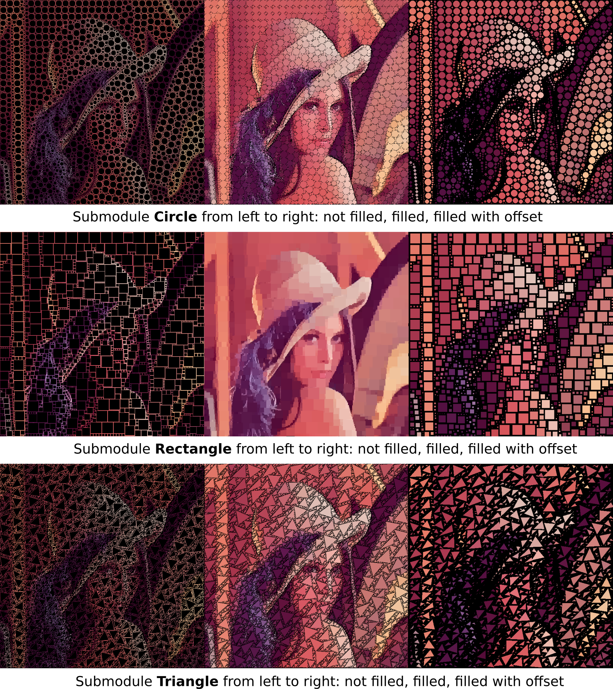

# **Artwork**
## About
The idea of this project was given by Jeff Clark's [Word Portrait](http://www.neoformix.com/2008/EinsteinWordPortrait.html) on his website [neoformix.com](http://www.neoformix.com), which shows an image of Albert Einstein only consisting of the text "Genius". Fiete Botschen and I decided to take this image as inspiration for an university Computer Vision course project in 2015. We successfully implemented an algorithm which generates similar Word Portraits like the one from Jeff Clark.

Till 2015 this project was put on hold. In January, 2018 I started to refactore and optimize the code by using a summed-area table, which boosted the runtime overwhelming well. Furthermore I implemented some submodules based on this algorithm, which allows you to create images consisting of Triangles, Circles and Rectangles (and maybe more soon). Some examples can be seen below.

## Word Portrait


For the result above i used this [Image](http://www.abc.net.au/news/image/2912674-3x2-940x627.jpg) of Albert Einstein with the free [Font](https://www.1001freefonts.com/28-days-later.font) from [www.1001freefonts.com](www.1001freefonts.com).

Render settings in XML file:

```
<rendersettings>
  <boolean name="colorMode" value="false"/>
  <string name="imgFileFormatOutput" value=".png" />
  <string name="imgFilePath" value="<path_to_einstein_image>"/>
  <color name="resultBackground" value="0,0,0"/>
  <integer name="printTheshold" value="75"/>
  <integer name="printThesholdStepSize" value="15"/>
  <integer name="meanThresholdMin" value="13"/>
  <integer name="meanThresholdMax" value="255"/>
  <boolean name="saveUsedImg" value="false"/>
</rendersettings>

```

Submodule **Words** settings:
```
<words>
  <boolean name="renderWords" value="true"/>
  <string name="fontPath" value="<path_to_font_28-days-later>"/>
  <string name="text" value="Genius"/>
  <float name="fontStartSize" value="35"/>
  <float name="fontStepSize" value="1"/>
  <float name="fontMinSize" value="0"/>
</words>
```

Runtime: 37.478s (seconds).

## Dependencies
* [Qt](https://www.qt.io/) (version 5.10)

## Usage
If you installed Qt Creator IDE already you can easily open the project with the provided `.pro` file. Select the right Qt version and press configure. After that select `Release` as compile mode and press compile to build the program. For compiling Qt creates a folder outside the main directory called `build-ArtWork-...-Release` where the executable will be created. All possible render options can be set within an XML file. Therefor you do not need to recompile the program every time you changed some parameters.

### Linux
Go to your built executable and open a terminal to run it via command line with. If everything works finde a help message should be printed.

`./artwork [OPTIONS] <rendersettings.xml>`

A help message is included by `./artwork -h` or `./artwork --help` and will print the following lines.
```
Artwork version 0.0.1, Copyright (c) 2018 Christoph Kreisl
Usage: artwork [options] <rendersettings.xml>
Options/Arguments:
   -h --help   Display this help text
   -i iname    Load the input image from a path denoted by "iname"
   -o oname    Write the output image with the name denoted by "oname"
               If there is a file type it will be removed. Set output file type in XML
               rendersettings!
For more information check https://github.com/ckreisl
```

You can use all image types which are supported by the Qt `QImage` class.

(tested on Ubuntu 16.04 04/17/2018)

### Windows
Running the programm via command line (Power Shell) could be a little bit inconvenient, since you have to copy `.dll` files from Qt into your directory where your ArtWork executable lies. Because of that simply run it within Qt Creator. Command line arguments can be set by the following steps:

    1. On the left panel in Qt Creator select 'Project'. The symbol is an open-end wrench.
    2. Select 'Run'
    3. Set your command line arguments

Finally build your program in `Release` mode and press run.

(tested on Windows 10 64bit 04/20/2018)

### MacOS
Via command line navigate to your folder where the programm is built. Qt creates an `Artwork.app` where your executable file is stored. You can run the program via command line with:

`ArtWork.app/Contents/MacOs/ArtWork [OPTIONS] <rendersettings.xml>`

If you successfully built the program a help message will be displayed. For more information check the **Linux** section.

(tested on MacOS High Sierra 04/20/2018)

## Some more examples


## Status and License
Licensed under LGPLv3 and GPLv3.

Copyright (c) Christoph Kreisl
